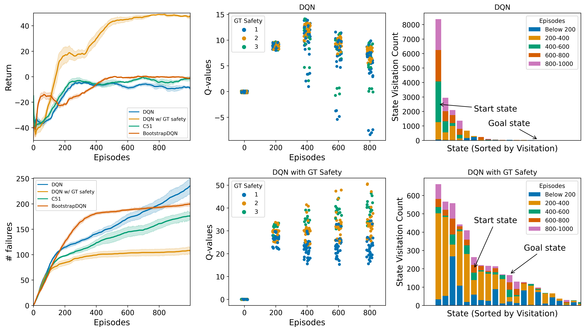
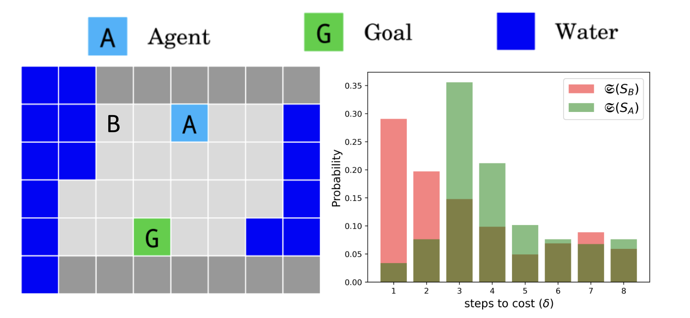
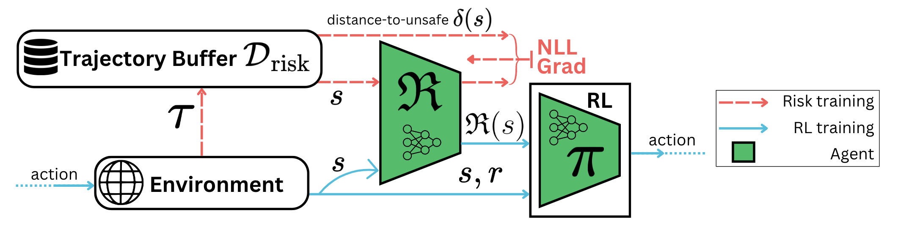
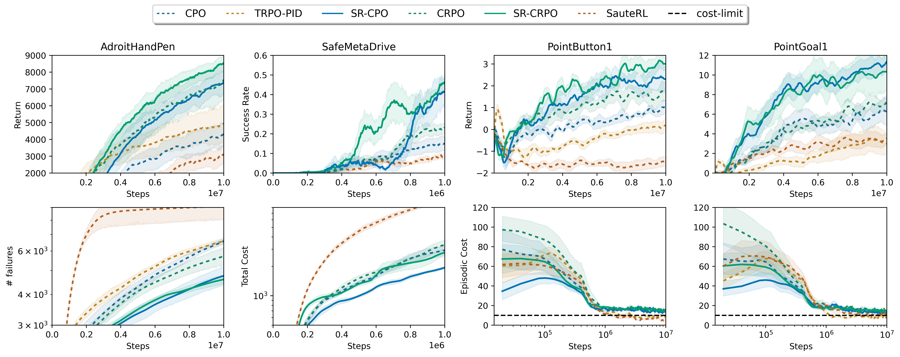
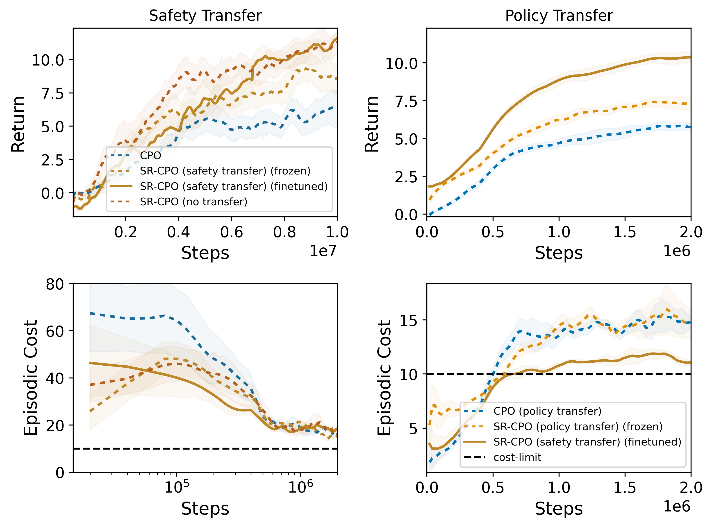
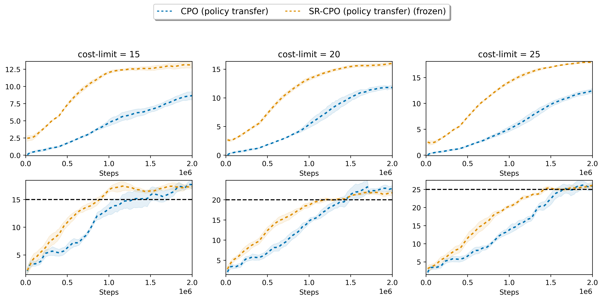

<div class="paper-header">
    <h1 class="paper-title">Safety Representations for Safer Policy Learning</h1>
    
    <p class="paper-description">
        Learning state-centric safety representations to enable safer and more efficient reinforcement learning through improved risk-reward tradeoffs.
    </p>

    <p class="conference-name">ICLR 2025</p>

    <div class="authors-list">
        <div class="author"><a href="https://github.com/manila95">Kaustubh Mani</a></div>
        <div class="author"><a href="https://scholar.google.ca/citations?user=62a5KoUAAAAJ&hl=en">Vincent Mai</a></div>
        <div class="author"><a href="https://velythyl.github.io/">Charlie Gauthier</a></div>
        <div class="author"><a href="https://anniesch.github.io/">Annie S. Chen</a></div>
        <div class="author"><a href="https://samernashed.github.io/">Samer Nashed</a></div>
        <div class="author"><a href="https://liampaull.ca/">Liam Paull</a></div>
    </div>

    <div class="paper-links">
        <a href="https://arxiv.org/pdf/2502.20341" class="paper-link">
            <i class="fas fa-file-pdf"></i> Paper
        </a>
        <a href="https://github.com/montrealrobotics/srpl/" class="paper-link">
            <i class="fab fa-github"></i> Code
        </a>
        <a href="#" class="paper-link disabled">
            <i class="fas fa-video"></i> Video (Coming Soon)
        </a>
    </div>
</div>

## Motivation

[Add your motivation text here]

<div class="figure-container">
    
    <div class="figure-caption">Figure 1: Motivation and overview of our approach.</div>
</div>

## Safety Representations

[Add your safety representations text here]

<div class="figure-row">
    <div class="figure-container">
        
        <div class="figure-caption">Figure 2: Safety representation learning.</div>
    </div>
    <div class="figure-container">
        
        <div class="figure-caption">Figure 3: Safety representation analysis.</div>
    </div>
</div>

## Improved Sample Efficiency and Safety

[Add your improved sample efficiency and safety text here]

<div class="figure-container">
    
    <div class="figure-caption">Figure 4: Sample efficiency results.</div>
</div>


## Transferrable Representations

[Add your transferrable representations text here]


<div class="figure-container">
    
    <div class="figure-caption">Figure 5: Transferring safety representation across tasks.</div>
</div>


<div class="figure-container">
    
    <div class="figure-caption">Figure 6: Transferring safety representation across constraint thresholds.</div>
</div>


## Citation

<div class="citation">
If you find this work useful, please cite:

```bibtex
@article{mani2024safety,
  title={Safety Representations for Safer Policy Learning},
  author={Mani, Kaustubh and Mai, Vincent and Gauthier, Charlie and Chen, Annie S and Nashed, Samer and Paull, Liam},
  journal={arXiv preprint arXiv:2502.20341},
  year={2024}
}
```
</div> 