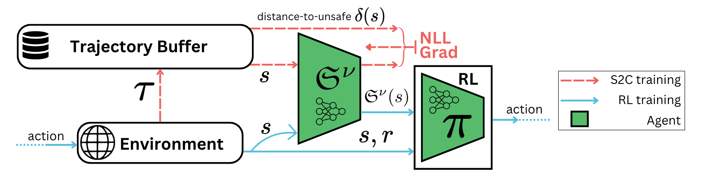

<div class="paper-header">
    <h1 class="paper-title">Safety Representations for Safer Policy Learning</h1>
    
    <p class="paper-description">
        Learning state-centric safety representations to enable safer and more efficient reinforcement learning through improved risk-reward tradeoffs.
    </p>

    <p class="conference-name">ICLR 2025</p>

    <div class="authors-list">
        <div class="author"><a href="https://github.com/manila95">Kaustubh Mani</a></div>
        <div class="author"><a href="https://scholar.google.ca/citations?user=62a5KoUAAAAJ&hl=en">Vincent Mai</a></div>
        <div class="author"><a href="https://velythyl.github.io/">Charlie Gauthier</a></div>
        <div class="author"><a href="https://anniesch.github.io/">Annie S. Chen</a></div>
        <div class="author"><a href="https://samernashed.github.io/">Samer Nashed</a></div>
        <div class="author"><a href="https://liampaull.ca/">Liam Paull</a></div>
    </div>

    <div class="paper-links">
        <a href="https://arxiv.org/pdf/2502.20341" class="paper-link">
            <i class="fas fa-file-pdf"></i> Paper
        </a>
        <a href="https://github.com/montrealrobotics/srpl/" class="paper-link">
            <i class="fab fa-github"></i> Code
        </a>
        <a href="#" class="paper-link disabled">
            <i class="fas fa-video"></i> Video (Coming Soon)
        </a>
    </div>
</div>

## Motivation

Traditional safe RL methods penalize constraint violations, often leading to overly conservative behavior and poor exploration. This limits representation learning and degrades performance. We address this by learning state-centric safety representations from experience, enabling smarter exploration and better risk-reward tradeoffs.


<div class="figure-container">
    
    <div class="figure-caption">Figure 1: Traditional RL methods fail to learn accurate representations of safety resulting in conservative policies. Adding information about safety of the state (GT safety: Manhattan distance to the closes failure state) prevents this conservative behavior.</div>
</div>

## Safety Representations

We train a neural network to estimate a distribution over future constraint violations from each state, using past trajectories as supervision. This distributional prediction captures not just the expected risk, but also the uncertainty and tail behavior of potential violations. We extract a learned safety representation from this distribution and augment the policy’s state input with it, enabling safety-aware and risk-sensitive decision making while optimizing reward.


<div class="figure-row">
    <div class="figure-container">
        
        <div class="figure-caption">Figure 2: Safety representations.</div>
    </div>
    <div class="figure-container">
        
        <div class="figure-caption">Figure 3: SRPL Framework.</div>
    </div>
</div>

## Improved Sample Efficiency and Safety

We evaluate our approach on four continuous control tasks covering locomotion, manipulation and navigation. Across all environments, augmenting standard RL algorithms with our learned safety representations leads to faster constraint satisfaction, fewer safety violations, and improved sample efficiency. Our method also achieves a better risk-reward tradeoff, enabling agents to reach high task performance with significantly lower safety costs.


<div class="figure-container">
    
    <div class="figure-caption">Figure 4: Safety and Sample efficiency results.</div>
</div>


## Transferrable Representations

Because the safety representation is learned in a state-centric and policy-agnostic way, it generalizes across tasks with similar dynamics. We show that a representation trained on PointButton1 can be transferred zero-shot to PointGoal1, resulting in immediate reductions in safety violations and faster policy learning. With minimal fine-tuning, the transferred representation further improves performance, highlighting its effectiveness in reusing safety knowledge across tasks.


<div class="figure-container">
    
    <div class="figure-caption">Figure 5: Transferring safety representations across tasks.</div>
</div>


<!-- 
<div class="figure-container">
    
    <div class="figure-caption">Figure 6: Transferring safety representation across constraint thresholds.</div>
</div> -->


## Citation
If you find this work useful, please cite:

```bibtex
@article{mani2025safety,
  title={Safety Representations for Safer Policy Learning},
  author={Mani, Kaustubh and Mai, Vincent and Gauthier, Charlie and Chen, Annie and Nashed, Samer and Paull, Liam},
  journal={arXiv preprint arXiv:2502.20341},
  year={2025}
}
```
